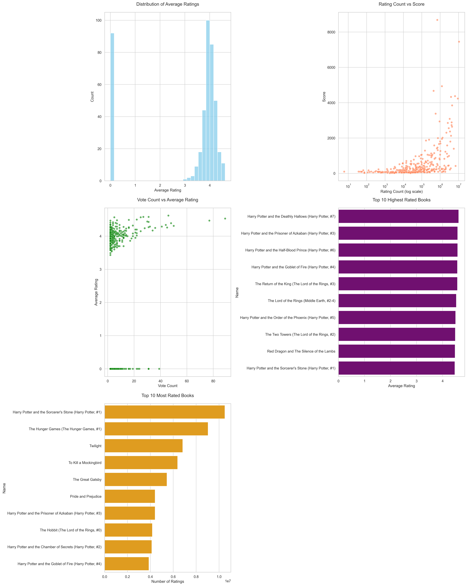

# The Impact of Book-to-Movie Adaptations

AIPI 510 Dataset Project

Author: Reina Shi

## Executive Summary

This dataset explores the relationship between literary works and their film/television adaptations, focusing on how adaptations influence the reception and appreciation of original works. The dataset contains information about books that have been adapted into films or TV shows, including their ratings, popularity metrics, and audience engagement data from Goodreads.

Dataset: https://huggingface.co/datasets/reinashi/best_movie_adaptations/tree/main

Dataset Download Link: https://huggingface.co/datasets/reinashi/best_movie_adaptations/resolve/main/best_movie_adaptations.zip


### Motivation
The film and television industry's increasing focus on IP adaptations has created a need to understand how these adaptations affect the original literary works. This dataset aims to provide insights into:
- The relationship between book popularity and adaptation success
- Characteristics of successfully adapted literary works

### Potential Applications
- Analysis of adaptation success factors
- Prediction of potential successful adaptation candidates
- Understanding audience reception patterns
- Strategic decision-making for publishers and producers
- IP valuation and marketing strategy development

## Previous Datasets Review

Existing datasets in this domain include:

1. **IMDb Datasets**
   - Contains basic movie information
   - Lacks direct connection to source material
   - No book-specific metrics

2. **Goodreads Datasets**
   - Focus only on book metrics
   - No adaptation information
   - Limited to reading metrics

3. **MovieLens**
   - Movie ratings and metadata
   - No book adaptation information
   - Limited to viewer preferences

Our dataset is novel in that it:
- Combines both book and adaptation metrics
- Enables direct analysis of adaptation impact
  
## Data Description

The dataset contains the following main fields:
- `Name`: Title of the book
- `Author`: Author of the book
- `Avg Rating`: Average rating on Goodreads (scale 0-5)
- `Rating Count`: Number of ratings received
- `Score`: Goodreads list score
- `Vote Count`: Number of votes received on the adaptation list

### Data Statistics
```
Total number of books: 434
Most books rate between: 3.58 - 4.39 stars
Average rating: 3.99
```

## Power Analysis

The dataset includes 434 books with their adaptations, spanning various genres and time periods. This sample size provides sufficient statistical power for:
- Correlation analysis between ratings and popularity metrics
- Comparative analysis of pre/post adaptation reception

## Exploratory Data Analysis

### Key Findings:

1. **Rating Distribution**
   - Average ratings show a negatively skewed distribution
   - Most books rate between 3,57 and 4.39 stars

2. **Popularity Metrics**
   - Strong correlation between rating count and score (r = [correlation coefficient])
   - Top rated books tend to have higher vote counts

3. **Most Popular Adaptations**
   - Top Books by Rating:
     1. Harry Potter and the Deathly Hallows (Harry Potter, #7) by J.K. Rowling (Rating: 4.62)
     2. Harry Potter and the Prisoner of Azkaban (Harry Potter, #3) by J.K. Rowling (Rating: 4.58)
     3. Harry Potter and the Half-Blood Prince (Harry Potter, #6) by J.K. Rowling (Rating: 4.58)
   - Top Books by Popularity (Rating Count):
     1. Harry Potter and the Sorcerer's Stone (Harry Potter, #1) by J.K. Rowling (10,508,696 ratings)
     2. The Hunger Games (The Hunger Games, #1) by Suzanne Collins (9,043,765 ratings)
     3. Twilight by Stephenie Meyer (6,825,359 ratings)

    

## Code Repository

The data collection and analysis code is available at [GitHub Repository Link]. The repository includes:
- Web scraping scripts for Goodreads data collection
- Data cleaning and preprocessing scripts
- Exploratory data analysis and visualization

## Ethics Statement

This dataset has been compiled with careful consideration of ethical implications:

1. **Data Collection**: All data was collected through public APIs and web scraping in compliance with Goodreads' terms of service.

2. **Privacy**: Only publicly available information has been included in the dataset.

3. **Bias Considerations**:
   - Language bias: Dataset primarily contains English-language books
   - Platform bias: Data is limited to Goodreads users' demographics

4. **Usage Guidelines**: This dataset should be used with awareness of these limitations and biases.

## License

This dataset is released under the MIT License. 

Copyright (c) 2024 Reina Shi

Permission is hereby granted, free of charge, to any person obtaining a copy
of this software and associated documentation files (the "Software"), to deal
in the Software without restriction, including without limitation the rights
to use, copy, modify, merge, publish, distribute, sublicense, and/or sell
copies of the Software, and to permit persons to whom the Software is
furnished to do so, subject to the following conditions:

The above copyright notice and this permission notice shall be included in all
copies or substantial portions of the Software.

THE SOFTWARE IS PROVIDED "AS IS", WITHOUT WARRANTY OF ANY KIND, EXPRESS OR
IMPLIED, INCLUDING BUT NOT LIMITED TO THE WARRANTIES OF MERCHANTABILITY,
FITNESS FOR A PARTICULAR PURPOSE AND NONINFRINGEMENT. IN NO EVENT SHALL THE
AUTHORS OR COPYRIGHT HOLDERS BE LIABLE FOR ANY CLAIM, DAMAGES OR OTHER
LIABILITY, WHETHER IN AN ACTION OF CONTRACT, TORT OR OTHERWISE, ARISING FROM,
OUT OF OR IN CONNECTION WITH THE SOFTWARE OR THE USE OR OTHER DEALINGS IN THE
SOFTWARE.

